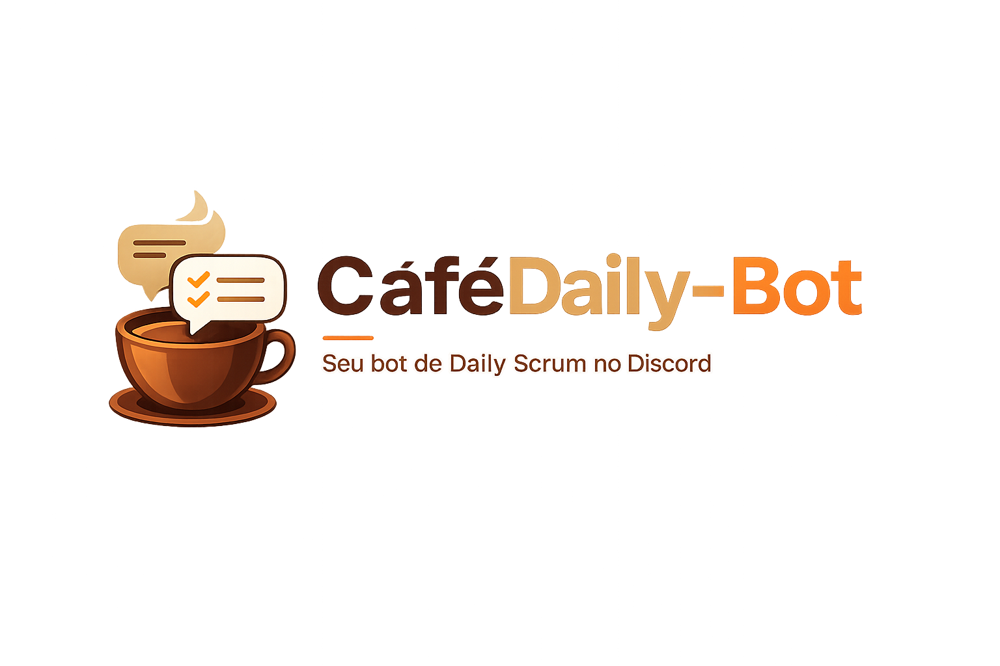
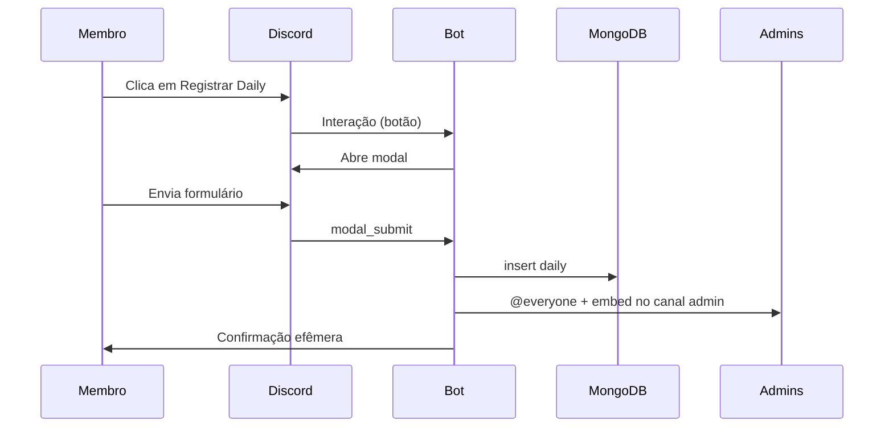

<p align="center">
  
</p>

<p align="center">
  <strong>Bot Discord para registrar Dailys com painel interativo, relatórios em embed e métricas de gestão para administradores.</strong>
</p>

<p align="center">
  <a href="https://www.python.org/"></a>
  <a href="https://discordpy.readthedocs.io/"></a>
  <a href="https://www.mongodb.com/"></a>
  <a href="https://www.docker.com/"></a>
</p>

<p align="center">
  
  
  
  
</p>

---

## Índice

- [Sobre](#sobre)
- [Funcionalidades](#funcionalidades)
- [Fluxo de uso](#fluxo-de-uso)
- [Comandos](#comandos)
- [Stack](#stack)
- [Pré-requisitos](#pré-requisitos)
- [Configuração no Discord](#configuração-no-discord)
- [Variáveis de ambiente](#variáveis-de-ambiente)
- [Instalação](#instalação)
- [Uso](#uso)
- [Estrutura do projeto](#estrutura-do-projeto)
- [Licença](#licença)

---

## Sobre

O **CaféDaily-Bot** centraliza o registro de **Daily Scrum** no Discord: a equipe preenche um formulário (modal) a partir de um painel com botão; cada envio é salvo no **MongoDB** e notificado em um canal privado para administradores, com embed formatado e menção `@everyone`.

Administradores também têm acesso a **métricas de gestão**: sequência de dias com daily, horários habituais de envio e ranking por streak.

---

## Funcionalidades

| Área | Descrição |
|------|-----------|
| **Painel interativo** | Imagem de banner + botão persistente *Registrar Daily* (sobrevive a reinício do bot) |
| **Modal** | 5 campos: projeto, ontem, hoje, amanhã e impedimentos |
| **Canal admin** | Embed com cor de marca `#2B140F`, autor, timestamp e campos organizados |
| **Persistência** | Cada daily na coleção `dailies` com índices por guild, usuário e data |
| **Métricas** | Streak atual, recorde, horário mais comum e ranking entre membros |
| **Deploy** | Docker Compose com serviços `bot` + `mongo` |

---

## Fluxo de uso



---

## Comandos

> Todos os comandos abaixo exigem permissão de **Administrador** no servidor. Respostas de métricas são **efêmeras** (só quem executou vê).

| Comando | Descrição |
|---------|-----------|
| `/daily-setup` | Publica o painel (imagem + botão) no canal atual |
| `/daily-stats` `membro` | Métricas individuais: totais, streaks, horários habituais |
| `/daily-ranking-streaks` `limite` | Ranking por dias consecutivos com daily (3–25, padrão 10) |

---

## Stack

| Camada | Tecnologia |
|--------|------------|
| Runtime | Python 3.12 |
| API Discord | [discord.py](https://discordpy.readthedocs.io/) 2.4+ |
| Banco | MongoDB 7 (Motor async) |
| Config | python-dotenv |
| Container | Docker + Docker Compose |

---

## Pré-requisitos

- Conta no [Discord Developer Portal](https://discord.com/developers/applications)
- **Docker** e **Docker Compose** (recomendado) **ou** Python 3.12+ e MongoDB acessível
- Servidor Discord com permissão para convidar o bot e usar slash commands

---

## Configuração no Discord

1. Crie uma **aplicação** e um **Bot**; copie o **token**.
2. Em **OAuth2 → URL Generator**, marque os escopos:
   - `bot`
   - `applications.commands`
3. Permissões sugeridas do bot:
   - Enviar mensagens · Incorporar links · Anexar arquivos
   - Usar comandos de aplicação
   - **Mencionar @everyone, @here e todos os cargos** (canal admin)
4. Convide o bot com a URL gerada.
5. Crie dois canais:
   - **Painel** — visível à equipe que vai registrar dailys
   - **Admin** — restrito à staff; destino dos relatórios
6. No canal admin, em **Permissões**, permita que o bot envie mensagens e use `@everyone`.

### Copiar IDs

Ative **Modo desenvolvedor** em *Configurações do usuário → Avançado* e use *Copiar ID* no servidor e nos canais.

---

## Variáveis de ambiente

Copie o exemplo e preencha:

```bash
cp .env.example .env
```

| Variável | Obrigatório | Descrição |
|----------|:-----------:|-----------|
| `DISCORD_TOKEN` | Sim | Token do bot |
| `DAILY_ADMIN_CHANNEL_ID` | Sim | ID do canal onde as dailys são publicadas |
| `DISCORD_GUILD_ID` | Não | ID do servidor — acelera sync dos slash commands em dev |
| `MONGODB_URI` | Sim | URI do MongoDB (`mongodb://mongo:27017` no Compose) |
| `MONGODB_DB_NAME` | Não | Nome do banco (padrão: `cafedaily`) |
| `TIMEZONE` | Não | Fuso IANA para datas/horários (padrão: `America/Sao_Paulo`) |

---

## Instalação

### Docker (recomendado)

```bash
git clone git@github.com:aethos-tech/CafeDaily-Bot.git
cd CafeDaily-Bot
cp .env.example .env
# Edite .env com token e IDs

docker compose up -d --build
```

Ver logs:

```bash
docker compose logs -f bot
```

> Após alterar o `.env`, recrie o container do bot (o `restart` sozinho **não** recarrega variáveis):
>
> ```bash
> docker compose up -d --force-recreate bot
> ```

### Local (sem Docker)

```bash
python3 -m venv .venv
source .venv/bin/activate
pip install -r requirements.txt
cp .env.example .env
# Edite .env — MONGODB_URI deve apontar para seu MongoDB

python -m src.main
```

---

## Uso

1. Um **administrador** executa **`/daily-setup`** no canal do painel.
2. O bot publica a **imagem do painel** e o botão **Registrar Daily**.
3. O membro clica, preenche o **modal** e envia.
4. O bot grava no MongoDB e envia o **embed** no canal admin com `@everyone`.
5. O membro recebe confirmação **privada** (efêmera).

Para acompanhar a equipe:

- **`/daily-stats @membro`** — visão individual (streak, horários, totais).
- **`/daily-ranking-streaks`** — ranking de consistência.

---

## Estrutura do projeto

```
CafeDaily-Bot/
├── docker-compose.yml
├── Dockerfile
├── requirements.txt
├── .env.example
└── src/
    ├── main.py              # Entrypoint, sync de commands, view persistente
    ├── daily_view.py        # Painel, modal, embed admin
    ├── admin_metrics.py     # /daily-stats e /daily-ranking-streaks
    ├── metrics_service.py   # Cálculo de streaks e horários
    ├── db.py                # MongoDB (Motor)
    └── assets/
        ├── banner_github.png
        └── painel_de_daily.png
```

---

## Licença

Defina a licença do projeto conforme a política da sua organização.

---

<p align="center">
  Desenvolvido por <strong>Ariel Sousa</strong> · <a href="https://github.com/aethos-tech">Aethos Tech</a>
</p>
